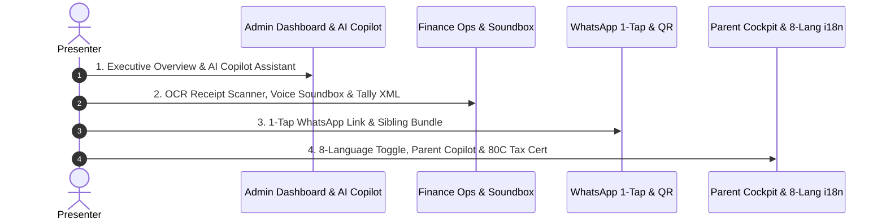

# Finora — Live Demo Presentation Guide & Walkthrough Script

> **Purpose**: Step-by-step presentation guide for live demos, hackathon judging, and stakeholder presentations. Formatted logically to walk through the system smoothly, highlighting flagship features, visual callouts, and technical fallbacks.

---

## 📋 Pre-Demo Setup Checklist (2 Minutes Before Demo)

- [ ] **Development Server**: Running on `http://localhost:3000` (or `pnpm dev`).
- [ ] **Public Tunnel**: `ngrok http 3000` active for mobile browser testing.
- [ ] **Audio Enabled**: Laptop volume set to 70%+ for the **AI Audio Soundbox** voice announcement and **Tactile Micro-Feedback**.
- [ ] **Browser Tabs Open**:
  1. Tab 1: Admin Dashboard (`/admin/dashboard`)
  2. Tab 2: Finance Operations (`/admin/ledger`)
  3. Tab 3: Reminders Queue (`/admin/reminders`)
  4. Tab 4: Parent Cockpit (`/parent/cockpit`)

---

## 🎬 Live Demo Script (5-Minute Winning Walkthrough)

---

### Act 1: Executive Dashboard & AI Copilot Assistant (1 Minute)

1. **Opening Statement**:  
   > *"Welcome to Finora — the first smart school fintech platform built for real-time fee reconciliation, automated risk scoring, and zero-friction parent payments."*

2. **Action 1 — Show Executive Metrics**:
   - Open `/admin/dashboard`.
   - Point out real-time collection progress, active fee assignments, and 3-factor defaulter risk tier cards (High / Medium / Low).

3. **Action 2 — Demonstrate AI Natural Language Query**:
   - In the Dashboard AI Query bar, type or select:  
     `"Show me cash vs UPI collection breakdown for this month"`
   - Point out how Gemini interprets ledger data into plain English/Hindi without manual SQL exports.

4. **Action 3 — Open AI Copilot Floating Assistant**:
   - Click the **AI Copilot** floating button in the bottom right.
   - Ask: `"How do I handle a bounced cheque?"` or `"Summarize high-risk defaulters"`
   - Show how the Copilot executes whitelisted tools and provides **retrieval-grounded guidance** straight from product specs.

---

### Act 2: Finance Operations, Bank Auto-Match & Tally Export (2.5 Minutes)

1. **Action 1 — Soundbox Toggle & Executive KPI Banner**:
   - Navigate to `/admin/ledger`.
   - Point out the **Executive KPI Header** showing real-time Settled Revenue, Pending Cheques, Flagged Anomalies, and the UPI/Cash/Cheque distribution bar.
   - Highlight the **Soundbox Toggle** in the top right (`Soundbox ON` · `ENG / HIN`). Click to toggle **`HIN`** (Hindi voice mode) and hear the soft tactile audio click cue.

2. **Action 2 — Flagship Showcase: Bank Statement Auto-Reconciliation Engine**:
   - Click the **"Bank Auto-Match 🤖"** tab.
   - Click **"📋 Load Sample Statement"** to load a raw ICICI/HDFC bank statement CSV.
   - Click **"Zap Auto-Match Statement Lines"**.
   - Show how Gemini AI & UTR Rule Matcher process statement lines in real time, displaying the **3-Column Match Board**:
     - 🟢 **100% Auto-Matched Lines**: Multi-select and click **"Batch Post Selected (N payments · ₹X)"**.
     - **LISTEN**: AI Soundbox audibly announces the total batch payment amount!
     - 🟡 **Probable Matches**: Show AI-suggested candidate students for verification.
     - 🔴 **Unlinked Suspense Queue**: Show unallocated bank deposits.

3. **Action 3 — Real-Time Multi-Field Search & 1-Click Batch Cheque Clearing**:
   - Return to the **Master Ledger** tab.
   - Type `"Rahul"` or `"CHQ-"` in the live search bar → Show instant filtering across student names, admission numbers, and UTR/Cheque IDs.
   - Select status filter **`CHEQUE PENDING`**. Check 2 pending cheques with checkboxes.
   - Click **"⚡ Batch Clear Cheques"** → Clears both cheques in 1 click with instant voice confirmation!

4. **Action 4 — Transaction Inspector Drawer & 1-Click CSV Export**:
   - Click any transaction row in the Master Ledger.
   - Watch the slide-over **Transaction Inspector Drawer** open, showing itemized GST tax calculations (Base Amount, GST Rate, Tax Amount) and full chronological Audit Trail history.
   - Click **"Export CSV"** next to **"Export Tally XML"** to download a formatted spreadsheet report.

5. **Action 5 — OCR Document Scanning & 1-Click Tally Prime Export**:
   - Switch to the **OCR Scanner** tab. Upload a sample deposit slip to show Gemini Vision extraction.
   - Click **"Export Tally XML"** on the Master Ledger to open the official Tally XML voucher payload (`vouchertype="Receipt"`).
   - Click **Export to Tally XML**.
   - Hear the **tactile chime audio feedback** as Finora instantly downloads double-entry Tally vouchers (`vouchertype="Receipt"`) for school accounting software integration.

---

### Act 3: Standout Innovations — WhatsApp 1-Tap Links & Dynamic QR (1 Minute)

1. **Action 1 — Reminders Queue & 1-Tap WhatsApp Link**:
   - Navigate to `/admin/reminders`.
   - Show the drafted reminder queue items.
   - Click the **💬 WhatsApp** button on a student's card.
   - Show how it opens WhatsApp with a pre-filled **1-Tap Payment Link**:
     `"Dear Parent, fee of ₹5,000 is due for Rahul. Tap to Pay via UPI: https://finora.school/pay/fa-123"`

2. **Action 2 — Smart Sibling Bundling**:
   - Point out a family with 2+ children (e.g. Rahul & Ananya).
   - Show how Finora aggregates both siblings into a single consolidated card (*"Pay ₹14,000 Total for Rahul & Ananya"*).

3. **Action 3 — Dynamic Student UPI QR Code**:
   - Show the generated dynamic UPI QR code containing embedded transaction references (`tr=feeAssignmentId`) ensuring **100% auto-reconciliation on payment arrival**.

---

### Act 4: Parent Cockpit, 8-Language Localization & 80C Tax Cert (1 Minute)

1. **Action 1 — Multi-Child Parent Cockpit**:
   - Switch to `/parent/cockpit`.
   - Show the clean parent dashboard aggregating total household dues across siblings with an instant student switcher.

2. **Action 2 — 8-Language Indic Localization Toggle**:
   - Click the **Globe Language Switcher** in the top header.
   - Show the dropdown supporting **8 Indian Languages** (English, Hindi, Bengali, Marathi, Telugu, Tamil, Gujarati, Kannada).
   - Select **Hindi (हिंदी)** or **Marathi (मराठी)**.
   - Watch the entire parent portal instantly translate (*"कुल बकाया शुल्क"*, *"भुगतान करें"*).
   - Explain how missing dynamic phrases use **Gemini AI Batch Translation** fallback seamlessly.

3. **Action 3 — Parent AI Copilot & GST Explainer**:
   - Click the Parent AI Copilot assistant.
   - Ask: `"Is GST charged on my child's tuition fees?"`
   - Show how the Copilot clarifies GST rules (Exempt tuition vs Taxable lab/sports fees) using the parent's actual fee types.

4. **Action 4 — Section 80C Tax Certificate Generator**:
   - Switch to `/parent/dues` and scroll to the **Tax Cert** section.
   - Click **"Section 80C Tax Cert (FY 2025-26)"**.
   - Show how Finora automatically isolates pure tuition fee components paid during the financial year, outputting an official claimable tax certificate.

5. **Action 5 — Parent Payment Simulation, Soundbox & GST Receipt**:
   - Click **Pay Now** on a due. Complete the Sandbox UPI payment.
   - **LISTEN**: Finora's AI Soundbox fires automatically in the parent view too!
   - Download the instant **GST-Compliant A4 / POS Receipt PDF**.

---

### Act 5: Technical Excellence & Closing Statement (30 Seconds)

1. **Key Technical Highlights to Mention**:
   - **0 TypeScript Errors** (`tsc --noEmit`).
   - **54/54 Automated Tests Passing**.
   - **IndexedDB Offline Queueing** with background sync conflict resolution.
   - **Zero External API Key Requirements** for WhatsApp links, Dynamic QRs, Tactile Micro-Feedback, and AI Audio Soundbox.

2. **Closing Statement**:
   - *"Finora turns school fee collection from an administrative headache into a 5-second, 1-tap seamless experience for both schools and parents. Thank you!"*

---

## 🛡️ Demo Rehearsal & Fallback Plan

| Potential Issue | Rehearsal Fallback Action |
|---|---|
| **Gemini API Slow/Rate-Limited** | Finora automatically falls back to raw rule-engine reason strings (`flag_reason`). Narration never blocks UI writes. |
| **No Internet / Offline Mode** | Submit a cash payment entry on `/admin/ledger`. Show how it saves to IndexedDB with status `queued`, syncing automatically on reconnection. |
| **Browser Speech Audio Muted** | Ensure system volume is up. If browser blocks autoplay speech, click anywhere on the page once to unlock the Web Audio context. |
