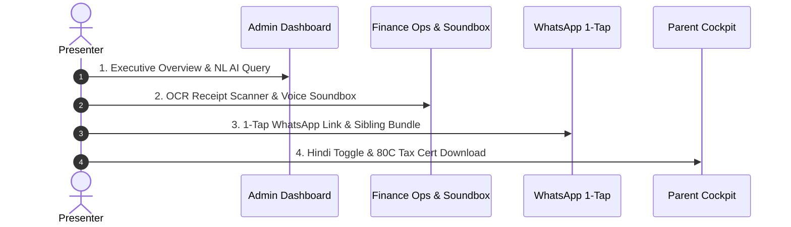

# Finora — Live Demo Presentation Guide & Walkthrough Script

> **Purpose**: Step-by-step presentation guide for live demos, hackathon judging, and stakeholder presentations. Formatted logically to walk through the system smoothly, highlighting flagship features, visual callouts, and technical fallbacks.

---

## 📋 Pre-Demo Setup Checklist (2 Minutes Before Demo)

- [ ] **Development Server**: Running on `http://localhost:3000` (or `pnpm dev`).
- [ ] **Public Tunnel**: `ngrok http 3000` active for mobile browser testing.
- [ ] **Audio Enabled**: Laptop volume set to 70%+ for the **AI Audio Soundbox** voice announcement.
- [ ] **Browser Tabs Open**:
  1. Tab 1: Admin Dashboard (`/admin/dashboard`)
  2. Tab 2: Finance Operations (`/admin/ledger`)
  3. Tab 3: Reminders Queue (`/admin/reminders`)
  4. Tab 4: Parent Cockpit (`/parent/cockpit`)

---

## 🎬 Live Demo Script (5-Minute Winning Walkthrough)

---

### Act 1: The Executive Dashboard & AI Natural Language Query (1 Minute)

1. **Opening Statement**:  
   > *"Welcome to Finora — the first smart school fintech platform built for real-time fee reconciliation, automated risk scoring, and zero-friction parent payments."*

2. **Action 1 — Show Executive Metrics**:
   - Open `/admin/dashboard`.
   - Point out the real-time collection progress, active fee assignments, and defaulter risk tier cards.

3. **Action 2 — Demonstrate AI Natural Language Query**:
   - In the Dashboard AI Query bar, type or select:  
     `"Show me cash vs UPI collection breakdown for this month"`
   - Point out how Gemini interprets the ledger data into plain English/Hindi without manual SQL exports.

---

### Act 2: Finance Operations & AI Audio Fee Soundbox (1.5 Minutes)

1. **Action 1 — Soundbox Toggle**:
   - Navigate to `/admin/ledger`.
   - Highlight the **Soundbox Toggle** in the top right (`Soundbox ON` · `ENG / HIN`).
   - Click the language badge to toggle to **`HIN`** (Hindi voice mode).

2. **Action 2 — OCR Document Scanning & Voice Announcement**:
   - Click the **OCR Scanner** tab.
   - Upload or select a sample bank deposit slip / cheque image.
   - Watch Gemini Vision extract the fee amount (**₹5,000**), student name, and date.
   - Click **Confirm & Post to Ledger**.
   - **LISTEN**: Finora's AI Soundbox audibly announces in Hindi:  
     🔊 *"राहुल शर्मा, कक्षा 5 के लिए ₹5,000 प्राप्त हुए।"*

3. **Action 3 — Cheque Clearance**:
   - Open a pending cheque transaction and click **Clear Cheque**.
   - Hear instant audio voice confirmation!

---

### Act 3: Standout Innovations — WhatsApp 1-Tap Links & Dynamic QR (1 Minute)

1. **Action 1 — Reminders Queue & 1-Tap WhatsApp Link**:
   - Navigate to `/admin/reminders`.
   - Show the drafted reminder queue items.
   - Click the **💬 WhatsApp** button on a student's card.
   - Show how it opens WhatsApp with a pre-filled **1-Tap Payment Link**:
     `"Dear Parent, fee of ₹5,000 is due for Rahul. Tap to Pay via UPI: https://finora.school/pay/fa-123"`

2. **Action 2 — Smart Sibling Bundling**:
   - Point out a family with 2+ children (e.g. Rahul & Ananya).
   - Show how Finora aggregates both siblings into a single consolidated card (*"Pay ₹14,000 Total for Rahul & Ananya"*).

3. **Action 3 — Dynamic Student UPI QR Code**:
   - Show the generated dynamic UPI QR code containing the embedded transaction reference (`tr=feeAssignmentId`) ensuring **100% auto-reconciliation on payment arrival**.

---

### Act 4: Parent Cockpit & Section 80C Income Tax Certificate (1 Minute)

1. **Action 1 — Multi-Child Parent Cockpit**:
   - Switch to `/parent/cockpit`.
   - Show the clean parent dashboard aggregating total household dues with an instant student switcher.

2. **Action 2 — 1-Click Hindi / English Toggle**:
   - Click the **Hindi Toggle** in the top header.
   - Watch the entire parent portal instantly translate into Hindi (*"कुल बकाया शुल्क"*, *"भुगतान करें"*).

3. **Action 3 — Section 80C Tax Certificate Generator**:
   - Switch to `/parent/history`.
   - Click **"Section 80C Tax Cert (FY 2025-26)"**.
   - Show how Finora automatically extracts pure tuition fee components paid during the financial year, outputting an official claimable tax certificate.

4. **Action 4 — Parent Payment Simulation & GST Receipt**:
   - Click **Pay Now** on Parent Dues.
   - Complete the Sandbox UPI payment simulation.
   - Download the instant **GST-Compliant A4 / POS Receipt PDF**.

---

### Act 5: Technical Excellence & Closing Statement (30 Seconds)

1. **Key Technical Highlights to Mention**:
   - **0 TypeScript Errors** (`tsc --noEmit`).
   - **54/54 Automated Tests Passing**.
   - **IndexedDB Offline Queueing** with background sync conflict resolution.
   - **Zero External API Key Requirements** for WhatsApp links, Dynamic QRs, and AI Audio Soundbox.

2. **Closing Statement**:
   - *"Finora turns school fee collection from an administrative headache into a 5-second, 1-tap seamless experience for both schools and parents. Thank you!"*

---

## 🛡️ Demo Rehearsal & Fallback Plan

| Potential Issue | Rehearsal Fallback Action |
|---|---|
| **Gemini API Slow/Rate-Limited** | Finora automatically falls back to raw rule-engine reason strings (`flag_reason`). Narration never blocks UI writes. |
| **No Internet / Offline Mode** | Submit a cash payment entry on `/admin/ledger`. Show how it saves to IndexedDB with status `queued`, syncing automatically on reconnection. |
| **Browser Speech Audio Muted** | Ensure system volume is up. If browser blocks autoplay speech, click anywhere on the page once to unlock the Web Audio context. |
